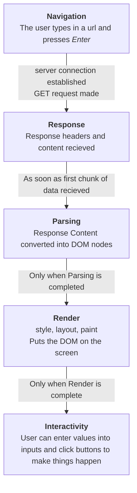

# Federated Modules: The Future of Code Sharing?

## The History of Chirper INC
Chirper is an Imaginary Narrative Company, initially founded in 1893 to ask the general public to write down descriptions of the chirps of birds for the chance to win a collectable pin. The data Chirper gathers is then sold on to Ornithologists.

>As a narrative company in a story about javascript bundling, chirper's adoption of technology follows a path to tell a story about how web technologies have evolved in response to the limitations faced at each step along the way. The years listed are not the years technologies came out, instead these are windows into what a 'typical' code base may have looked like at the time. Other less imaginary companies have used some of these technologies, but they also solved them with many other tools and frameworks.

### How Browsers Work

Then, now, and into the foreseable future, the steps browsers use to populate web pages follows the same basic steps. 

Over the course of the evolution of web technologies, painpoints around these steps have driven many of the core evolutions, and we will refer back to this chart often.

#### [1993 - Static Page on The World Wide Web](chirper-inc/2008-async-and-require-js/README.md)

>In 1993 Chirper moves online. With www.chirper.com/index.html Chirper offers a revolutionary new experience on the World Wide Web. Users can now send descriptions of chirps over internet to save on the cost of stamps.

Before JavaScript Webpages loaded as **static** HTML. The pages were not **dynamic**, but they could still be **interactive**.

In the early days, interactive web applications meant requesting a full new page to update content based user actions.

In 1993, The internet was slow, but still sent small files much faster than the mail. 

#### [1998 - Inline Javascript Tags](chirper-inc/2008-async-and-require-js)
Javascript is initially introduced in 1994 supporting inline scripts and now content on pages can be **dynamic** allowing for user interactions to update content in the page without reloading.

>Chirper adopted JS in 1998. Adding 2 alerts to the page with user agreements. 
 >  - One alert has the user agree to not enter "Bart Simpson" as a value (it was a simpler time). 
 > - The other alert is in a seperate script tag and has the user agree to let Chirper sell the user responses. 
>
>By 98 Chirper had added addional pages and they need to copy over the code into the new pages html files for the alerts to work

Because the JS code is directly embedded in the HTML file it is not easily **portable**

#### 2013 - script tags with src
The next evolution 

**dependency management**, **rendering is blocked**

#### async module loading and RequireJS

**request bottlenecks**

#### Entry Point Bundlers

#### Single Page Web Apps
#### Federated Modules