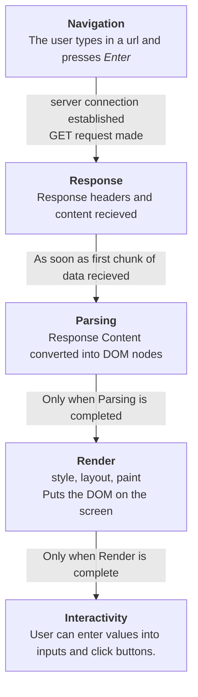

# Federated Modules: The Future of Code Sharing

## A Fast, Opinionated, and Partially Accurate History

### How Browsers Work

Then, now, and into the foreseable future, the steps browsers use to populate the page follows the same basic steps.

### Chirper INC
Chirper is an Imaginary Narrative Company, initially founded in 1893 to ask the general public to write down descriptions of the chirps of birds for the chance to win a collectable pin. The data Chirper gathers is then sold on to Ornithologists.

>As a narrative company in a story about javascript bundling, chirper's adoption of technology will ignore most other internet technologies

#### 1993: www.chirper.com/index.html
Chirper moves online, offering a webpage where users can send descriptions of chirps over the world wide web.

Before JavaScript Webpages loaded as **static** HTML. The pages were not **dynamic**, but they could still be **interactive**.

In the early days, interactive web applications meant requesting a full new page to update content based user actions.

In 1993, The internet was slow, but still sent small files much faster than the mail. 

#### Inline JS
Javascript is initially introduced in 1994 supporting inline scripts and webpages can be interactive.
Chirper was an early adopter, adding an alert 