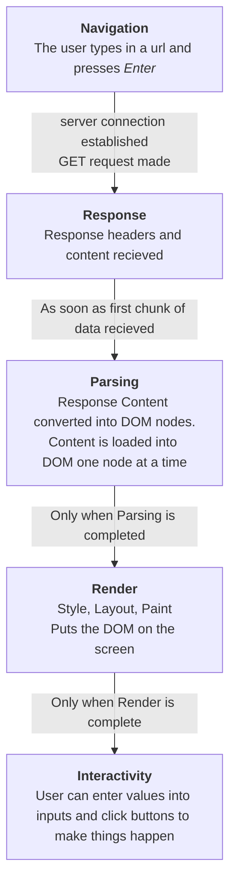
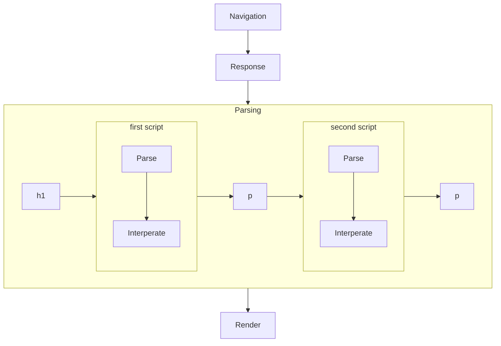
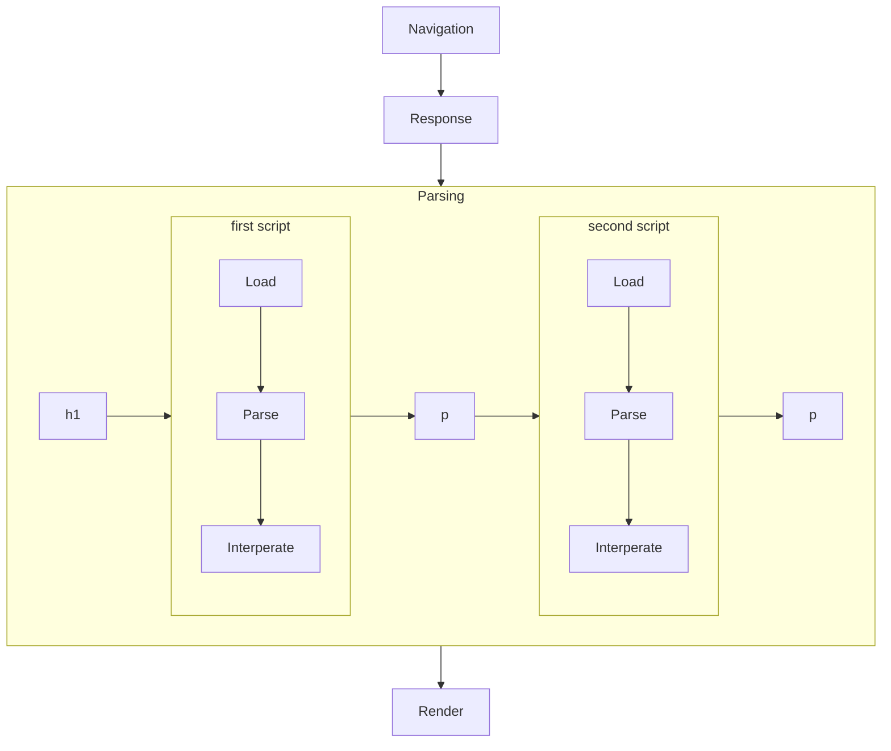
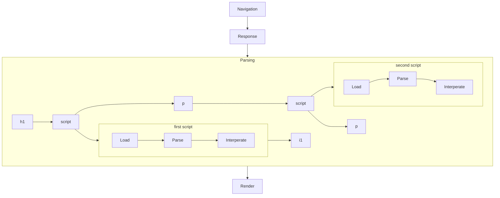

# Federated Modules: The Future of Code Sharing?


## Chirper INC
Chirper is an Imaginary Narrative Company, initially founded in 1893 to ask the general public to write down descriptions of the chirps of birds for the chance to win a collectable pin. The data Chirper gathers is then sold on to Ornithologists.

### The Eras Tour of Javascript History

>As a narrative company in a story about javascript bundling, chirper's adoption of technology follows a path to tell a story about how web technologies have evolved in response to the limitations faced at each step along the way. The years listed are not the years technologies came out, instead these are windows into what a 'typical' code base may have looked like at the time. No attempt has been made for the code to be genuinely historically accurateOther less imaginary companies have used some of these technologies, but they also solved them with many other tools and frameworks.
### How Browsers Work

Then, now, and into the foreseable future, the steps browsers use to populate web pages follows the same basic steps. 



Over the course of the evolution of web technologies, painpoints around these steps have driven many of the core evolutions, and we will refer back to this chart often.


### [1993 - Static Page on The World Wide Web](./chirper-inc/2008-async-and-require-js/README.md)

>In 1993 Chirper moves online. With www.chirper.com/index.html Chirper offers a revolutionary new experience on the World Wide Web. Users can now send descriptions of chirps over internet to save on the cost of stamps.

Before JavaScript Webpages loaded as **static** HTML. The pages were not **dynamic**, but they could still be **interactive**.

In the early days, interactive web applications meant requesting a full new page to update content based user actions.


In 1993, The internet was slow, but still sent small files much faster than the mail. 


### [1998 - Inline Javascript Tags](./chirper-inc/2008-async-and-require-js)
Javascript is initially introduced in 1994 supporting inline scripts and now content on pages can be **dynamic** allowing for user interactions to update content in the page without reloading.

 `<script>` tags are **blocking**, preventing the parsing of the remaining html document unitl they have been fully parsed, compiled, and interpreted

 For Example, the flowchart below shows how the following html is loaded

```html
<body>
    <h1>Example Header</h1>
    <script type="javascript">alert('first')</script>
    <p>hello</p>
    <script type="javascript">alert('second')</script>
    <p>hello</p>
</body>
```




>Chirper adopted JS in 1998. Adding 2 alerts to the page with user agreements. 
 >  - One alert has the user agree to not enter "Bart Simpson" as a value (it was a simpler time). 
 > - The other alert is in a seperate  `<script>` tag and has the user agree to let Chirper sell the user responses. 
>
>By now, Chirper had also added addional pages and they need to copy over the code into the new pages html files for the alerts to work

Because the JS code is directly embedded in the HTML file it is not easily **portable**. 

### [2003 - Remote loaded scripts](./chirper-inc/2003-src-loading/README.md)
Allowing `<script>` tags to be loaded remotely using the `src` attribute made javascript code **portable** and developers can now use the same code defined in `.js` files  in multiple different html pages.

> Chirper used remote loading to move the duplicate inline scripts into files loaded by the pages

Many scripts update the global namespace in someway, order matters, variable conflicts are messy, **dependency management** is becoming a problem, `<script>` tags are still **blocking**, and slow script loads from the remote can make the delay to rendering even longer.

```html
<body>
    <h1>Example Header</h1>
    <script type="javascript" src="firstScript.js"></script>
    <p>hello</p>
    <script type="javascript" src="secondScript.js"></script>
    <p>hello</p>
</body>
```




### [2008 - async loading and RequireJS](./chirper-inc/2008-async-and-require-js/README.md)

async script tags helped get around the issue of **blocking** allowing the rest of the html document to continute to be parsed to the DOM and the JS executing as soon as it finishes loading in parallel. Race conditions with async make **dependency management** even more complicated.
```html
<body>
    <h1>Example Header</h1>
    <script type="javascript" src="firstScript.js" async></script>
    <p>hello</p>
    <script type="javascript" src="secondScript.js" async></script>
    <p>hello</p>
</body>
```




> Chirper adopted requirejs, a package that is typically included in source code by manually copying the file from the source hand, just like any other third party package at this time,. This is not a robust way of handling third party dependencies and led to issue with **version management**
Because multiple scripts are now loading parallel developers are now facing issues with **request bottlenecks** as browsers can only support a limited number of simultanious connections over http and dependency webs grew into many js files being rewuired for each page.

### [2013 - Browserify and npm]()
By adopting browserify, developers were able to get a handle on the **request bottlenecks** and the **version management** of third party apps all at once. node had been developing server solutions in the background, and in support a package manager, `npm``, had been building a robust community of js utility packages. 
Browserify bundles the javascript for a page into a single file by just concatenating all of the files required into one long file. Along the way, it will replace any instances of `require('some-package')` with the contents of the package from npm.

While no longer suffering from request bloating, putting the entire contents of every library lead to bundle bloating with long download and interperate times delaying iteractivity and becoming an issue as more apps become base don async api requests to populate the page that wont start until the main js package has finished interpereting.

### [2018 - Webpack Tree Shacking]

Webpack is introduced as a way of not needing load every part of every library.
By creating dependency graphs, the bundle can be produced for each page as its own entry point with only the assets that will be used for that page included in the bundle.

### [2023 - Single Page Web Apps](./chirper-inc/2023-single-page-app/Readme.md)

Hard page loads have been a terribel user experience since the begninning, as the rest of the user experience became more streamlined, pages began to adopt the Single Page Web App model, Which means all users load the same html page with the same initial js bundle and the app handles in page navigation, fetching data and selecting new components internally without page changes

Not wanting to go back to the single giant bundle, new strategies for dynamically loading the chuncks of code needed were introduced by.

### [2028 - Federated Modules](./chirper-inc/2028-federated-modules/Readme.md)

This talk is about federated modules, I will come back and fill in the story, but follow the talk for the content here now

